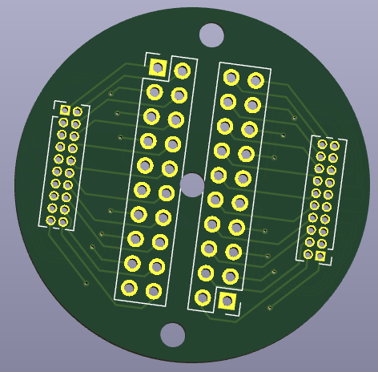

# Breakout board for WaveShare RP2040-LCD-1.28

WaveShare RP2040-LCD-1.28の1.27mmピッチのGPIOピンを2.54mmピットに変換するブレイクアウトです。適当に空けた2.6mmの穴3つ付き。

GPIOの配置などはWaveShareのWikiを参照してください。

https://www.waveshare.com/wiki/RP2040-LCD-1.28

## データ作成環境

KiCad 9.0.4

## 製造

基板のガーバーデータ、ドリルデータを生成して、JLCPCBなどで製作します。基板の厚みは1.2mm程度もあれば十分でしょう。

## 基板1枚あたりに必要な部材

* このデータから作成した基板 1枚
* 2x10 1.27mmピンヘッダー 2つ
* 2x10 2.54mmピンヘッダーもしくはピンソケット 2つ

## ライセンス / License

MIT License

2025 Akkiesoft