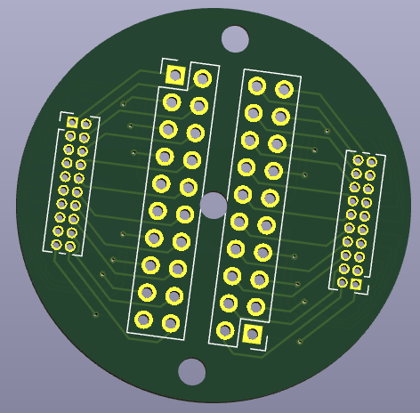
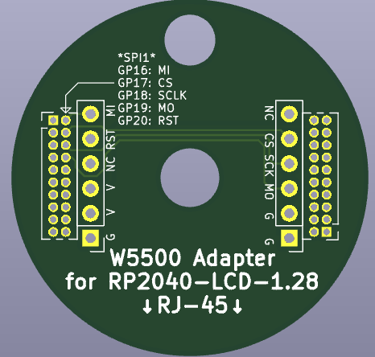

# Breakout boards for WaveShare RP2040-LCD-1.28

WaveShare RP2040-LCD-1.28のGPIOポートを利用した各種基板データ置き場です。

[GPIOの配置などはWaveShareのWikiを参照してください。](https://www.waveshare.com/wiki/RP2040-LCD-1.28)

* データ作成環境
    * KiCad 9.0.4
* 基板発注方法
    * のにそちしで基板のガーバーデータ、ドリルデータを生成します
    * JLCPCBなどで発注します
        * 基板の厚みは1.2mm程度もあれば十分です

## ブレイクアウトボード(board-breakout)

1.27mmピッチのGPIOピンを2.54mmピットに変換するブレイクアウトです。適当に空けた2.6mmの穴3つ付き。

基板1枚あたりに必要な部材は以下のとおりです。

* このデータから作成した基板 1枚
* 2x10 1.27mmピンヘッダー 2つ
* 2x10 2.54mmピンヘッダーもしくはピンソケット 2つ

## WIZnetチップ搭載Ethernetモジュール変換ボード(board-w5500)

RP2040-LCD-1.28にWIZnetチップ搭載Ethernetモジュールを搭載するための変換ボードです。

基板1枚あたりに必要な部材は以下のとおりです。

* このデータから作成した基板 1枚
* 2x10 1.27mmピンヘッダー 2つ
* WIZnetチップ搭載Ethernetモジュール
* お好みでロープロファイルピンヘッダー・ピンソケットの1x6を2つずつ
    * Ethernetモジュールのピンヘッダーは除去して付け替えます
    * 全体高を減らせます

GPIO配置は以下のとおりです。

* GP16: MI
* GP17: CSn
* GP18: SCK
* GP19: MO
* GP20: RST

## ライセンス / License

MIT License

2025 Akkiesoft